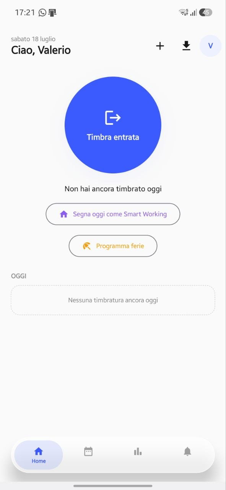
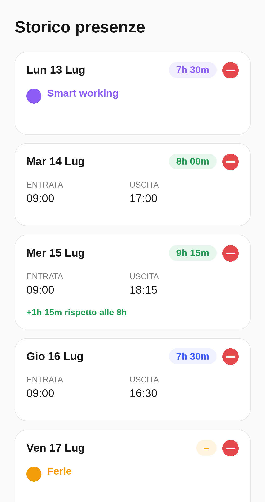
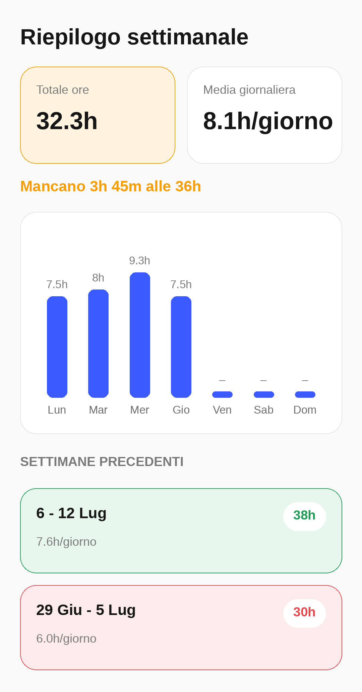
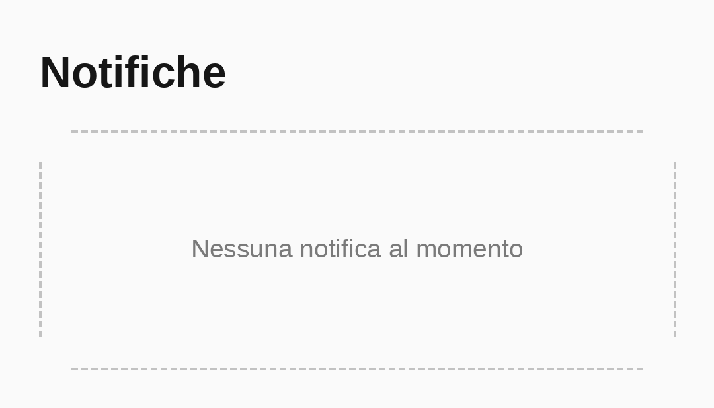

# ClockIn

App Android nativa per la gestione delle presenze in ufficio: timbra ingresso/uscita, segna smart working e ferie, tieni sotto controllo il monte ore contrattuale settimanale ed esporta tutto in Excel.

Costruita interamente in **Kotlin** con **Jetpack Compose** e **Material 3**.

> Nota: il nome visualizzato dell'app (icona, launcher, titolo) è **ClockIn**. Il package interno (`com.appresenze.presenze`) è rimasto invariato per non introdurre una migrazione più invasiva — è puramente un dettaglio tecnico, invisibile all'utente finale.

## Indice

- [Funzionalità](#funzionalità)
- [Screenshot](#screenshot)
- [Stack tecnico](#stack-tecnico)
- [Come compilare il progetto](#come-compilare-il-progetto)
- [Generare un APK e installarlo sul telefono](#generare-un-apk-e-installarlo-sul-telefono)
- [Struttura del progetto](#struttura-del-progetto)

## Funzionalità

**Timbratura**
- Un tap per timbrare ingresso/uscita, con timer live delle ore già lavorate in giornata.
- Aggiunta manuale di una timbratura dimenticata (data + ora) tramite un popup dedicato.
- Blocco automatico dei doppi inserimenti: non è possibile registrare due ingressi o due uscite nello stesso giorno; l'app mostra un errore chiaro se ci si prova.
- Eliminazione di singole timbrature o dell'intera giornata, con richiesta di conferma prima della cancellazione definitiva.

**Smart working & ferie**
- Un tap accredita automaticamente 7h30 per una giornata di smart working, senza bisogno di timbrare.
- "Programma ferie" apre un calendario per selezionare un giorno singolo o un intervallo, marcato automaticamente come ferie.

**Riepilogo settimanale**
- Totale ore, media giornaliera e grafico a barre della settimana corrente.
- Storico delle settimane precedenti, con badge colorato in base al raggiungimento delle 36 ore contrattuali: verde se raggiunte/superate, arancione se sotto soglia per via di giorni di ferie, rosso altrimenti.

**Export / Import**
- Esporta l'intero storico in un file `.xlsx` (colonne Data, Ora d'ingresso, Ora d'uscita, Ore in ufficio), con celle colorate per ingressi (verde) e uscite (giallo), salvato in Download e pronto da condividere.
- Importa un file `.xlsx` precedentemente esportato per ricostruire da zero lo storico presenze.

**UI**
- Bottom navigation bar semi-trasparente con transizioni animate tra le schede.
- Nessun dato demo/hardcoded: l'app parte vuota e si popola solo con i tuoi dati reali.

## Screenshot

> "Home" è uno screenshot reale del dispositivo. Storico, Riepilogo e Notifiche sono mockup illustrativi (stessi colori/layout del codice reale) in attesa di essere sostituiti con screenshot veri — vedi [screenshots/README.md](screenshots/README.md).

| Home | Storico |
|---|---|
|  |  |

| Riepilogo | Notifiche |
|---|---|
|  |  |

## Stack tecnico

| | |
|---|---|
| Linguaggio | Kotlin |
| UI | Jetpack Compose + Material 3 |
| Architettura | `AndroidViewModel` + Compose state (`mutableStateOf` / `mutableStateListOf`) |
| Persistenza | File locale su `filesDir` (nessun database esterno) |
| Data/ora | `java.time` (nativo da API 26+, nessuna desugaring necessaria) |
| Export/Import Excel | Writer/reader `.xlsx` (OOXML) scritto a mano, senza dipendenze esterne (niente Apache POI) |
| minSdk / targetSdk | 29 / 34 |

## Come compilare il progetto

1. Clona il repository:
   ```bash
   git clone https://github.com/TheChemistWhite/ClockIn.git
   ```
2. Apri la cartella con **Android Studio** (Giraffe o più recente).
3. Lascia sincronizzare Gradle al primo avvio.
4. Premi **Run ▶** con un emulatore o un telefono collegato via USB (con Debug USB attivo).

## Generare un APK e installarlo sul telefono

1. In Android Studio: **Build → Build Bundle(s) / APK(s) → Build APK(s)**.
2. L'APK generato si trova in `app/build/outputs/apk/debug/app-debug.apk`.
3. Trasferiscilo sul telefono (cavo USB, email, Drive, ecc.) e installalo dal gestore file, oppure collega il telefono via USB e premi **Run ▶** in Android Studio per installarlo direttamente.
4. Se richiesto, concedi il permesso "Installa app sconosciute" all'app usata per aprire il file `.apk`.

Richiede Android 10 (API 29) o superiore.

## Struttura del progetto

```
app/src/main/java/com/appresenze/presenze/
├── data/                # Modelli + AttendanceViewModel (unica fonte di verità)
├── export/              # Writer/reader .xlsx per export e import
├── ui/
│   ├── components/      # Dialoghi riutilizzabili (AddEntryDialog, VacationDialog, BottomNavBar…)
│   ├── screens/         # Home, Storico, Riepilogo, Notifiche
│   └── theme/           # Colori, tipografia, tema Material 3
└── MainActivity.kt       # Navigazione a schede con transizioni animate
```
